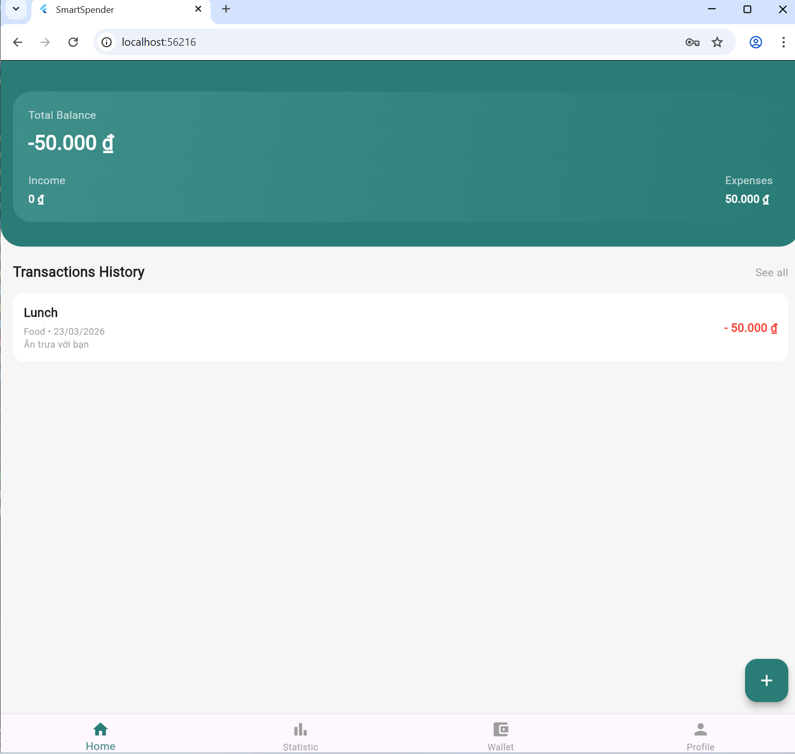
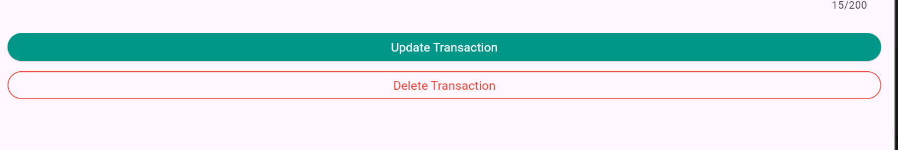
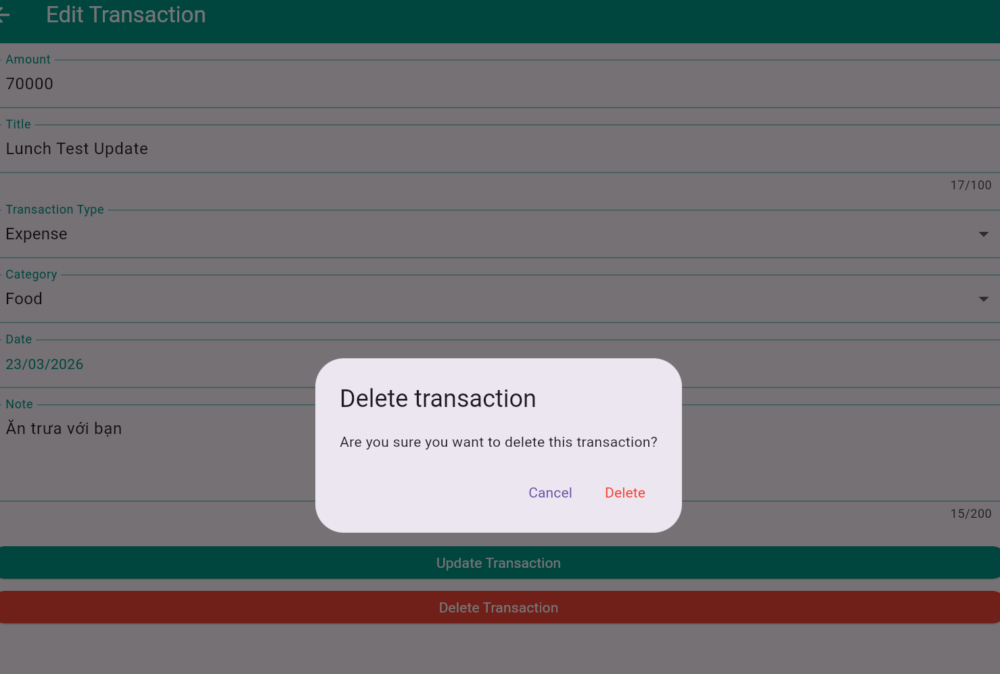
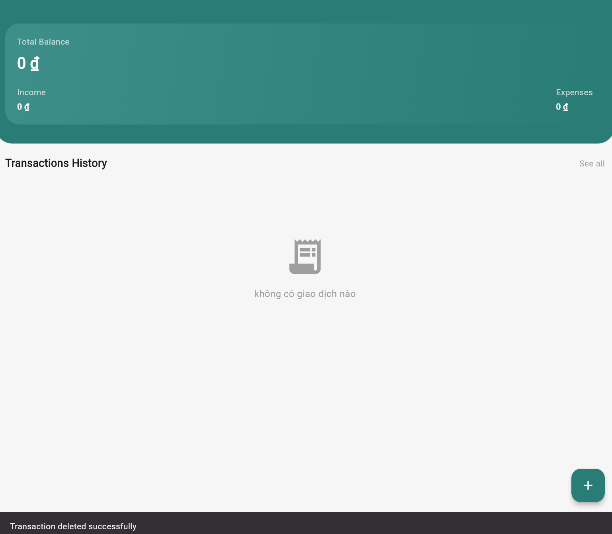

# HƯỚNG DẪN TEST MOBILE API CHO LEADER (TEST TRỰC TIẾP)

Ngày cập nhật: 23/03/2026
Mục tiêu: Leader trực tiếp test toàn bộ luồng mobile gọi API thật, ghi kết quả rõ ràng để chốt sprint.

---

## 1. PHÂN VAI

- Leader: tester chính, trực tiếp test mobile app theo từng bước bên dưới và ghi PASS/FAIL.
- Sơn: sửa lỗi mobile khi Leader báo FAIL (UI, state, parse, flow).
- Thành viên backend: sửa lỗi API/DB nếu có lỗi phía server.

---

## 2. ĐẦU VÀO BẮT BUỘC (LEADER TỰ CHUẨN BỊ)

Chỉ bắt đầu test khi đã có đủ 4 thông tin sau:

1. Base URL đang dùng

- Ví dụ: ngrok hoặc localhost.

2. Tài khoản test

- email:
- password:

3. Backend status

- Backend đang chạy ổn định, không lỗi server.

4. Scope test hôm nay

- Login -> Create -> Read -> Update -> Delete -> Error cơ bản.

---

## 3. CHUẨN BỊ MÔI TRƯỜNG MOBILE

### Bước M0 - Setup app

- [ ] Cập nhật đúng base URL trong app config.
- [ ] Chạy `flutter clean`.
- [ ] Chạy `flutter pub get`.
- [ ] Chạy `flutter run`.
- [ ] App mở được màn hình Login.

Mẫu ghi kết quả:

```text
[M0] PASS/FAIL:
- Mô tả ngắn: ...
- Screenshot (nếu FAIL): ...
```

Nếu FAIL:

- Gửi log flutter run + screenshot cho thành viên phụ trách sửa lỗi.
- Không qua bước tiếp theo khi app chưa mở được.

---

## 4. TEST FLOW CHI TIẾT CHO LEADER

## Bước M1 - Login

Thao tác:

1. Nhập email/password test.
2. Bấm Login.

Kỳ vọng:

- [ ] Đăng nhập thành công.
- [ ] Không crash.
- [ ] Chuyển vào HomeScreen.

Mẫu ghi kết quả:

```text
[M1-LOGIN] PASS/FAIL:
- Thực tế: ...
- Lỗi (nếu có): ...
- Screenshot/Video: ...
```

---

## Bước M2 - Create transaction

Thao tác:

1. Bấm nút thêm transaction.
2. Nhập dữ liệu mẫu:

- title: Lunch Test
- amount: 50000
- type: expense
- category: food
- note: smoke test

3. Bấm Save.

Kỳ vọng:

- [ ] Hiện thông báo thành công.
- [ ] Quay lại danh sách.
- [ ] Không crash.

Mẫu ghi kết quả:

```text
[M2-CREATE] PASS/FAIL:
- Dữ liệu đã nhập: Lunch Test, 50000, expense, food
- Kết quả thực tế: ...
- Screenshot (nếu FAIL): ...
```

---

## Bước M3 - Read transaction

Thao tác:

1. Kiểm tra trên HomeScreen có item vừa tạo.
2. Kéo để refresh (pull-to-refresh).

Kỳ vọng:

- [ ] Item Lunch Test hiển thị đúng.
- [ ] Refresh hoạt động.

Mẫu ghi kết quả:

```text
[M3-READ] PASS/FAIL:
- Có thấy item hay không: ...
- Refresh: ...
- Screenshot (nếu FAIL): ...
```

---

## Bước M4 - Update transaction

Thao tác:

1. Mở màn hình sửa của item vừa tạo.
2. Sửa:

- title -> Lunch Test Updated
- amount -> 70000

3. Bấm Update.

Kỳ vọng:

- [ ] Cập nhật thành công.
- [ ] Danh sách hiện title/amount mới.

Mẫu ghi kết quả:

```text
[M4-UPDATE] PASS/FAIL:
- Dữ liệu mới: Lunch Test Updated, 70000
- Kết quả thực tế: ...
- Screenshot (nếu FAIL): ...
```

---

## Bước M5 - Delete transaction

Thao tác:

1. Xóa item vừa sửa (swipe, long-press, hoặc nút xóa).
2. Xác nhận xóa nếu có dialog.

Kỳ vọng:

- [ ] Xóa thành công.
- [ ] Item biến mất khỏi danh sách.

Mẫu ghi kết quả:

```text
[M5-DELETE] PASS/FAIL:
- Cách xóa đã dùng: ...
- Kết quả thực tế: ...
- Screenshot (nếu FAIL): ...
```

---

## Bước M6 - Error handling cơ bản

Thao tác:

1. Leader tạm dừng backend.
2. Leader thử tạo transaction.

Kỳ vọng:

- [ ] App hiện lỗi dễ hiểu.
- [ ] Không crash.

Mẫu ghi kết quả:

```text
[M6-ERROR] PASS/FAIL:
- Nội dung thông báo lỗi: ...
- Có dễ hiểu không: CÓ/KHÔNG
- Screenshot: ...
```

---

## 5. MẪU BÁO LỖI CHUẨN (BẮT BUỘC KHI FAIL)

Khi có FAIL, Leader gửi đúng mẫu này để thành viên phụ trách sửa nhanh:

```text
[CASE ID]: Mx-...
[Bước lỗi]: M1/M2/M3/M4/M5/M6
[Môi trường]: localhost/ngrok
[Bước tái hiện]:
1) ...
2) ...
3) ...

[Kỳ vọng]:
- ...

[Thực tế]:
- ...

[Bằng chứng]:
- screenshot: ...
- video (nếu có): ...
- log flutter run: ...

[Mức độ]: Critical/Major/Minor
[Owner sửa]: Sơn (mobile) hoặc Backend team (nếu nghi API)
[Trạng thái]: Open/Fixed/Retest Pass/Retest Fail
```

---

## 6. LUỒNG PHỐI HỢP KHI PHÁT SINH LỖI

1. Leader báo lỗi theo mẫu ở mục 5.
2. Sơn nhận lỗi và sửa phần mobile.
3. Leader re-test đúng case đó.
4. Nếu pass, đánh dấu "Retest Pass".
5. Nếu fail tiếp, gửi lại log mới và Sơn sửa tiếp.
6. Leader cập nhật bảng tổng hợp và chốt cuối buổi.

---

## 7. BẢNG TỔNG HỢP ĐỂ CHỐT

```text
M0-SETUP:   PASS
M1-LOGIN:   PASS
M2-CREATE:  PASS
M3-READ:    PASS
M4-UPDATE:  PASS
M5-DELETE:  PASS
M6-ERROR:   PASS

OVERALL: DEMO READY
```

Ghi chú thực tế buổi test 23/03/2026:

- M3 trên web không có pull-to-refresh, đã xác nhận bằng browser refresh (Ctrl+R/F5) và dữ liệu vẫn đúng.
- M5 đã được bổ sung nút Delete Transaction trên màn Edit, xóa thành công có dialog xác nhận.
- M6 hiển thị lỗi và không crash, tuy nhiên thông báo "An unexpected error occurred" còn chung chung (đề xuất cải thiện ở sprint sau).

Điều kiện chốt "Demo Ready":

- Tất cả M1-M5 PASS.
- Không còn lỗi Critical.
- Các lỗi còn lại (nếu có) chỉ ở mức Minor.

---

## 8. BIÊN BẢN CUỐI BUỔI

Leader: **\*\*\*\*\*\***\_\_\_\_\***\*\*\*\*\***
Tester chính (Leader): **\*\*\*\*\*\***\_\_\_\_\***\*\*\*\*\***
Người sửa mobile (Sơn): **\*\*\*\*\*\***\_\_\_\_\***\*\*\*\*\***
Ngày: 23 / 03 / 2026
Tổng thời gian test: **\_\_** giờ
Kết luận: Demo Ready

---

## 9. EVIDENCE (DÁN ẢNH CHO TEAM XEM)

Lưu ảnh vào thư mục `test_evidence/2026-03-23/`, sau đó dán link theo mẫu dưới đây:

```markdown
### M1 - Login

- Kết quả: PASS
- Ảnh: 

### M2 - Create

- Kết quả: PASS
- Ảnh form nhập: 
- Ảnh sau khi tạo: 

### M3 - Read

- Kết quả: PASS
- Ảnh: 

### M4 - Update

- Kết quả: PASS
- Ảnh trước update: 
- Ảnh sau update: 

### M5 - Delete

- Kết quả: PASS
- Ảnh nút delete: 
- Ảnh dialog xác nhận: 
- Ảnh sau khi xóa: 

### M6 - Error handling

- Kết quả: PASS
- Ảnh thông báo lỗi: 
```

Quy ước đặt tên ảnh:

- m1-login.png
- m2-create-form.pnggi
- m2-create-result.png
- m3-read.png
- m4-before.png
- m4-after.png
- m5-delete-button.png
- m5-delete-confirm.png
- m5-delete-result.png
- m6-error.png
