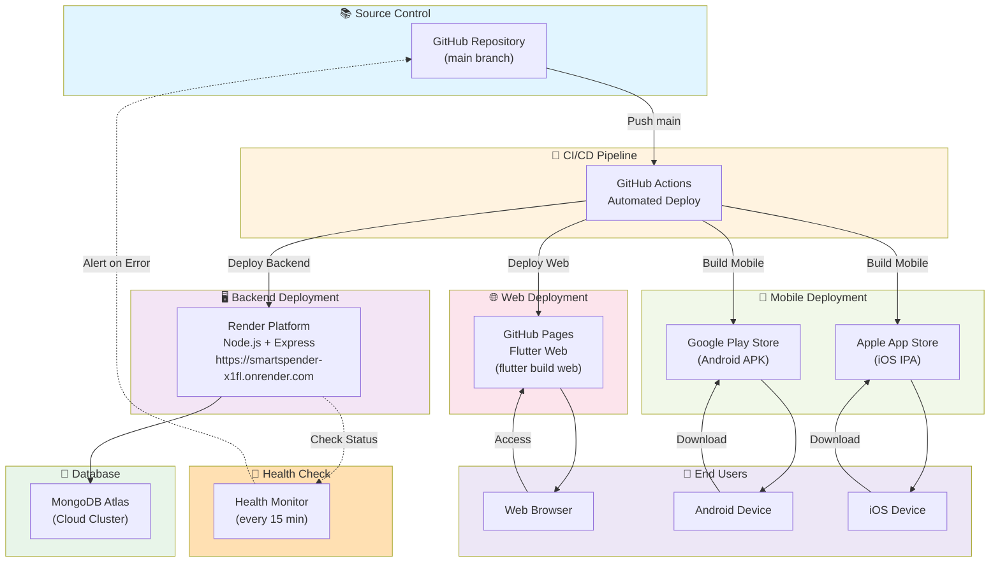

# Deployment Architecture - SmartSpender

Kiến trúc triển khai hệ thống SmartSpender - phiên bản cho slide thuyết trình.

## Biểu đồ Deployment



## Chi tiết triển khai

| Component        | Công nghệ        | Mô tả                                                     |
| ---------------- | ---------------- | --------------------------------------------------------- |
| **Source Code**  | GitHub           | Repository chính trên GitHub, nhánh `main` là production  |
| **CI/CD**        | GitHub Actions   | Tự động trigger khi push lên `main`                       |
| **Backend**      | Render + Node.js | REST API server triển khai trên Render platform           |
| **Database**     | MongoDB Atlas    | Cloud database, kết nối qua connection string             |
| **Web**          | GitHub Pages     | Flutter Web build, tự động deploy qua API                 |
| **Android**      | Play Store       | APK build qua GitHub Actions, đẩy thủ công lên Play Store |
| **iOS**          | App Store        | IPA build qua GitHub Actions, đẩy thủ công lên App Store  |
| **Health Check** | Monitor Script   | Kiểm tra backend mỗi 15 phút, alert nếu down              |

## Quy trình triển khai từng phần

### 1️⃣ Backend (Automatic)

```
Git Push (main)
    ↓
GitHub Actions trigger
    ↓
Build Node.js app
    ↓
Deploy to Render
    ↓
Health check: OK
```

### 2️⃣ Web (Automatic)

```
Git Push (main)
    ↓
GitHub Actions trigger
    ↓
flutter build web --release
    ↓
Push to GitHub Pages
    ↓
Live at: https://<username>.github.io/SmartSpender/
```

### 3️⃣ Mobile (Semi-automatic)

```
Git Push (main)
    ↓
GitHub Actions trigger
    ↓
flutter build apk/ipa
    ↓
Manual upload to Play Store / App Store
    ↓
Review & publish
```

## Biến môi trường triển khai

### Backend (Render)

```
PORT=3000
MONGODB_URI=mongodb+srv://<user>:<pass>@cluster.mongodb.net/smartspender
JWT_SECRET=<secure-key>
NODE_ENV=production
```

### Web (GitHub Pages)

```
API_BASE_URL=https://smartspender-x1fl.onrender.com/api/v1
APP_ENV=production
```

### Mobile (Build config)

```
API_BASE_URL=https://smartspender-x1fl.onrender.com/api/v1
APP_ENV=production
```

## Monitoring & Alerts

- **Health Check**: Mỗi 15 phút gọi `GET /api/health` trên Backend
- **Response Time**: Monitor performance metrics
- **Error Logs**: Ghi nhận lỗi 5xx từ API
- **Alert Channel**: Email/Slack khi backend down > 5 phút

## Scaling & Performance

- **Backend**: Render auto-scaling (based on traffic)
- **Database**: MongoDB Atlas multi-region replication
- **Web**: GitHub Pages CDN global
- **Mobile**: Direct download từ app stores

---

**Cập nhật:** 01/04/2026 | **Status:** Production Ready
