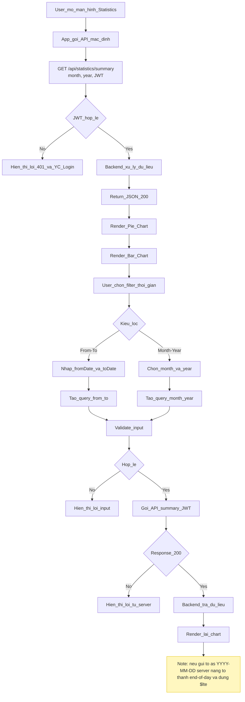

```mermaid
flowchart TD
  A[User_mo_man_hinh_Statistics] --> B[App_goi_API_mac_dinh]
  B --> C["GET /api/statistics/summary<br/>month, year, JWT"]
  C --> D{JWT_hop_le}
  D -- No --> E[Hien_thi_loi_401_va_YC_Login]
  D -- Yes --> F[Backend_xu_ly_du_lieu]
  F --> G[Return_JSON_200]
  G --> H[Render_Pie_Chart]
  H --> I[Render_Bar_Chart]
  I --> J[User_chon_filter_thoi_gian]
  J --> K{Kieu_loc}
  K -->|From-To| L[Nhap_fromDate_va_toDate]
  K -->|Month-Year| M[Chon_month_va_year]
  L --> N[Tao_query_from_to]
  M --> O[Tao_query_month_year]
  N --> P[Validate_input]
  O --> P
  P --> Q{Hop_le}
  Q -- No --> R[Hien_thi_loi_input]
  Q -- Yes --> S[Goi_API_summary_JWT]
  S --> T{Response_200}
  T -- No --> U[Hien_thi_loi_tu_server]
  T -- Yes --> V[Backend_tra_du_lieu]
  V --> W[Render_lai_chart]

  %% Extra note
  classDef note fill:#fff7c0,stroke:#e6c200
  Z[Note: neu gui to as YYYY-MM-DD server nang to thanh end-of-day va dung $lte]:::note
  W --> Z

```
