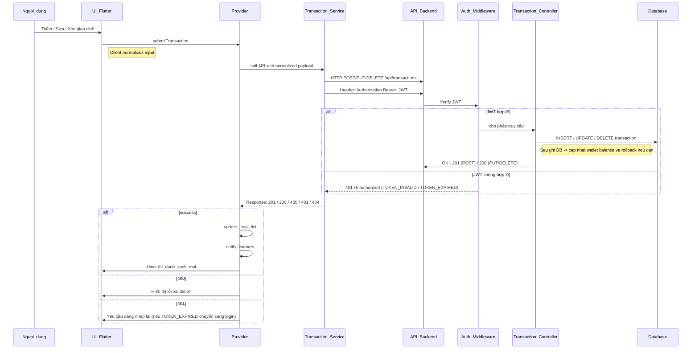

```mermaid
sequenceDiagram
  participant User as Nguoi_dung
  participant UI as UI_Flutter
  participant Provider as Provider
  participant Service as Transaction_Service
  participant API as API_Backend
  participant Auth as Auth_Middleware
  participant Controller as Transaction_Controller
  participant DB as Database

    User->>UI: Thêm / Sửa / Xóa giao dịch
    UI->>Provider: submitTransaction
    Note right of UI: Client normalizes input
    Provider->>Service: call API with normalized payload
    Service->>API: HTTP POST/PUT/DELETE /api/transactions
    Service->>API: Header: Authorization Bearer_JWT
    API->>Auth: Verify JWT
    alt JWT hợp lệ
      Auth->>Controller: cho phép truy cập
      Controller->>DB: INSERT / UPDATE / DELETE transaction
      Note right of Controller: Sau ghi DB -> cap nhat wallet balance va rollback neu can
      Controller->>API: OK - 201 (POST) / 200 (PUT/DELETE)
    else JWT không hợp lệ
      Auth-->>Service: 401 Unauthorized (TOKEN_INVALID / TOKEN_EXPIRED)
    end
    Service-->>Provider: Response: 201 / 200 / 400 / 401 / 404
    alt success
      Provider->>Provider: update_local_list
      Provider->>Provider: notifyListeners
      Provider->>UI: Hien_thi_danh_sach_moi
    else 400
      Provider->>UI: Hiển thị lỗi validation
    else 401
      Provider->>UI: Yêu cầu đăng nhập lại (nếu TOKEN_EXPIRED chuyển sang login)
    end
```
