# SmartSpender - Class Diagram & Visual Architecture

## 🎯 Class Diagram (Entity-Relationship)

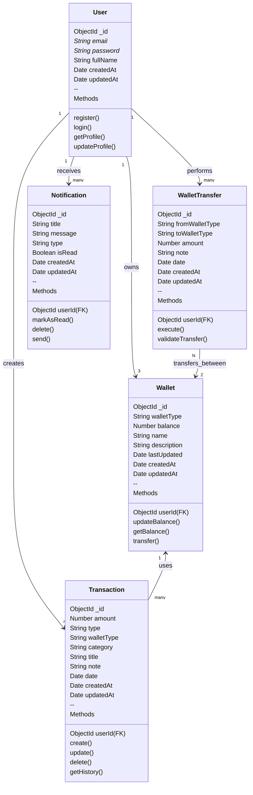

---

## 📊 Entity Relationship Diagram (ERD)

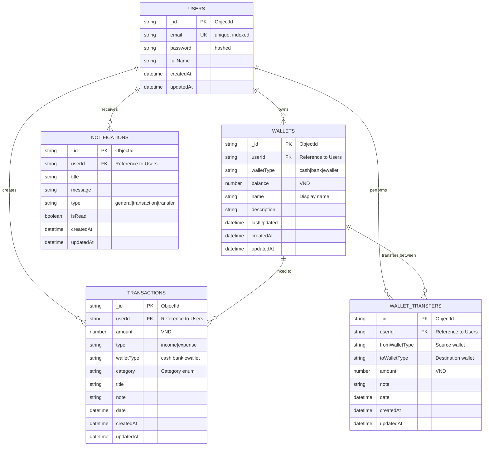

---

## 🔄 Data Flow Architecture

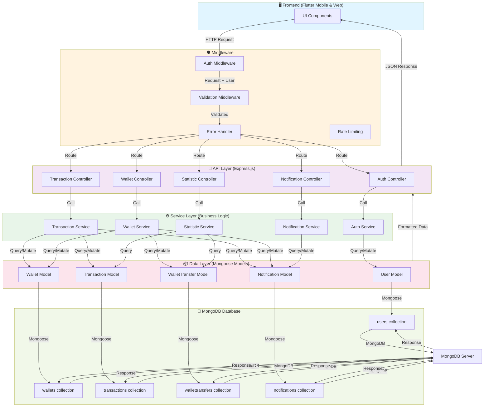

---

## 🔀 Transaction Flow Diagram

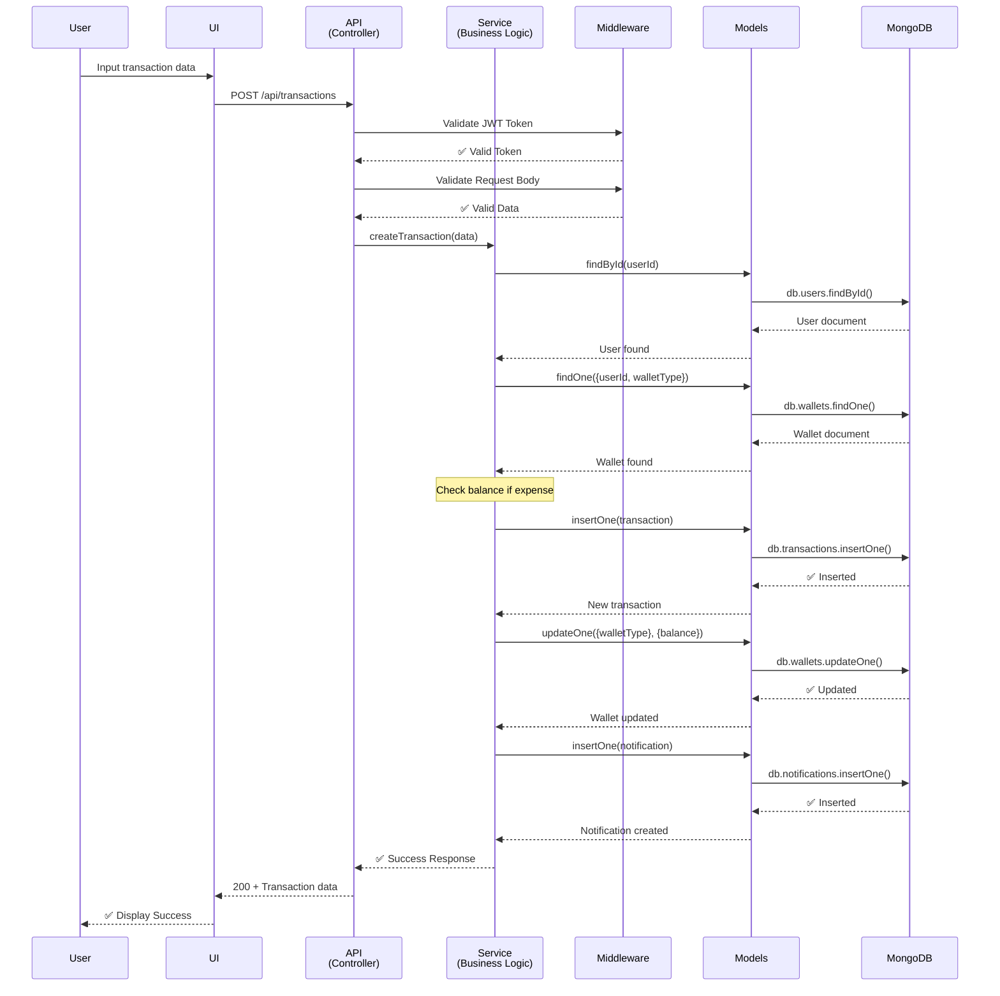

---

## 💱 Wallet Transfer Flow

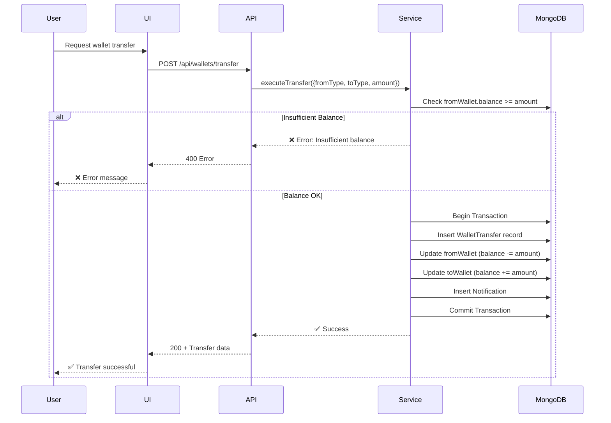

---

## 📈 Statistic Aggregation Pipeline

```mermaid
graph LR
    A["📊 Statistics Request<br/>(month/year)"] -->|aggregate| B["Filter<br/>userId + date range"]
    B -->|$match| C["Match expense/income<br/>transactions"]
    C -->|$group| D["Group by<br/>category"]
    D -->|$sort| E["Sort by<br/>total amount"]
    E -->|$project| F["Format output"]
    F -->|Response| G["📈 Chart Data<br/>(Pie/Bar Chart)"]

    style A fill:#e1f5ff
    style B fill:#fff3e0
    style C fill:#f3e5f5
    style D fill:#e8f5e9
    style E fill:#fce4ec
    style F fill:#f1f8e9
    style G fill:#c8e6c9
```

---

## 🗂️ Embedded vs Referenced Pattern

### Current Design: REFERENCING (Được sử dụng)

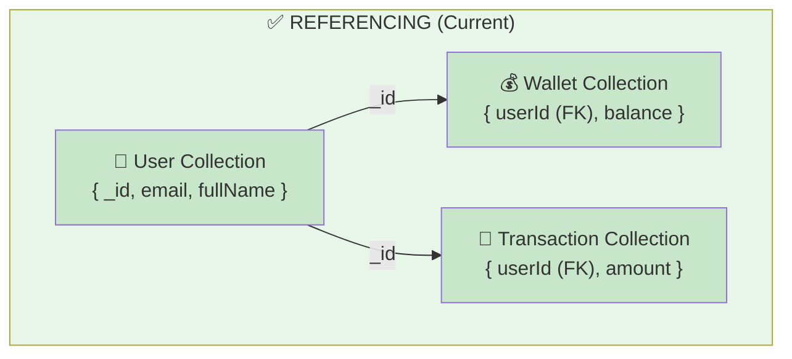

**Ưu điểm:**

- ✅ Dữ liệu không bị trùng lặp
- ✅ Dễ cập nhật (update một chỗ)
- ✅ Linh hoạt (thêm collection mới dễ dàng)
- ✅ Query riêng biệt → performance tốt

---

### Alternative: EMBEDDING (Không sử dụng)

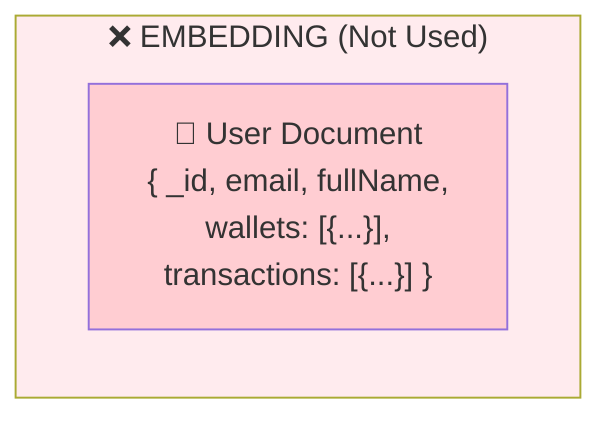

**Nhược điểm:**

- ❌ Document lớn → slow query
- ❌ 16MB limit của MongoDB
- ❌ Trùng lặp dữ liệu
- ❌ Cập nhật phức tạp

---

## 🔐 Data Security Model

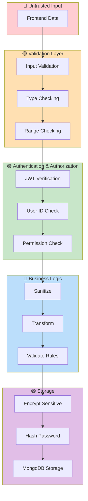

---

## 📊 Index Strategy

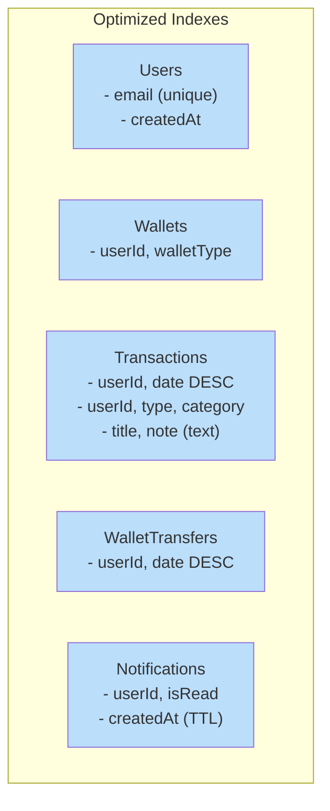

---

## 🎯 Growth Roadmap

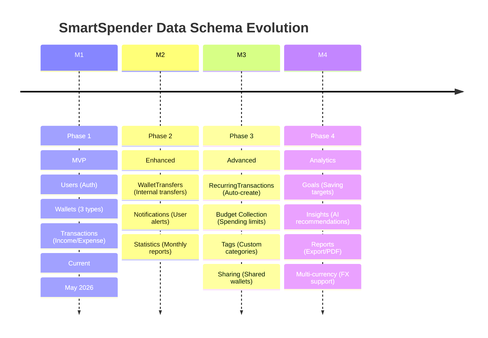

---

## 📋 Collection Statistics

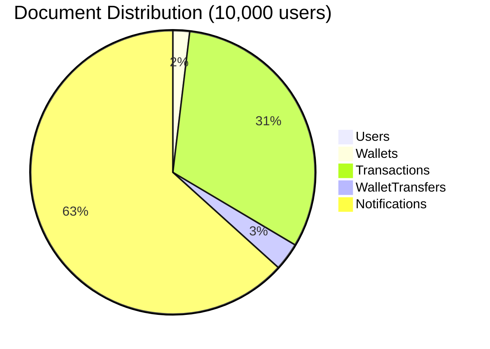

---

## 🚀 Performance Considerations

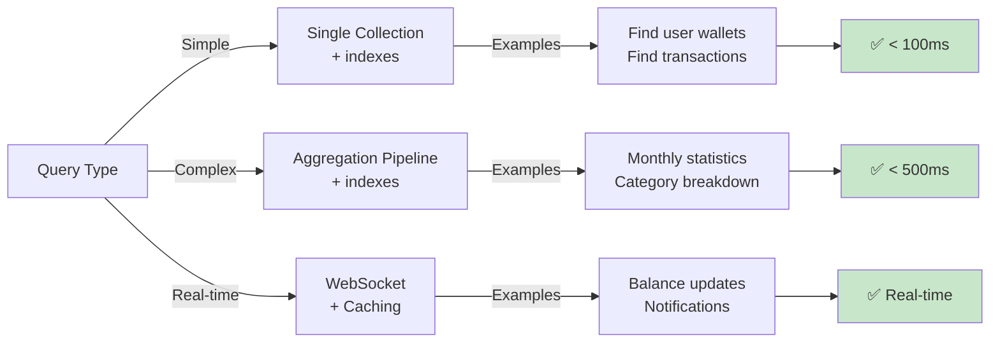
