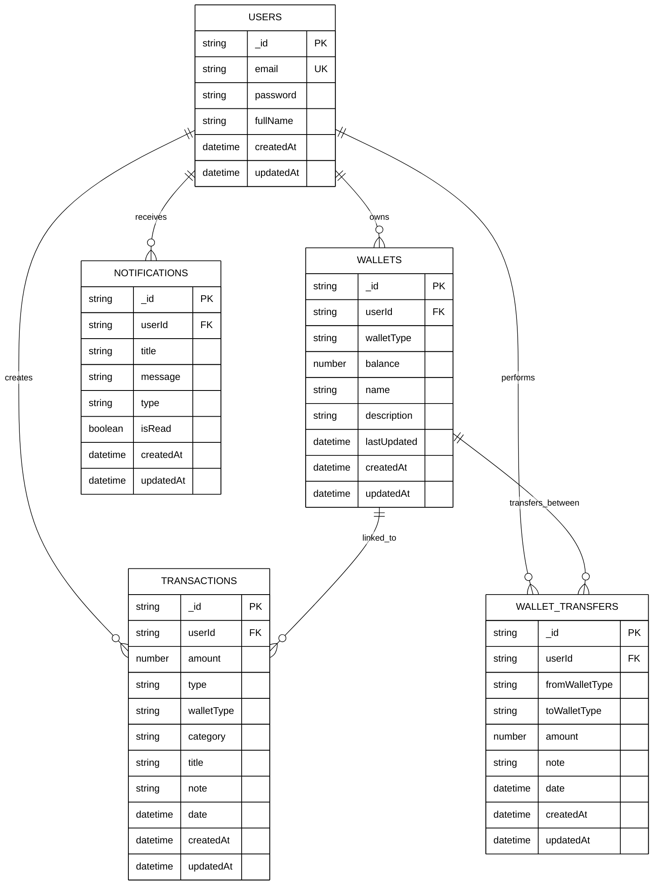

# SmartSpender - Database ERD (Print-Optimized)

## 📄 Sơ Đồ ERD Tối Ưu Cho In Báo Cáo (Trắng Đen)

### Mermaid ERD (Tối ưu in trắng đen)



---

## 📊 ASCII Art ERD - Bản In Trắng Đen Tiêu Chuẩn

```
╔════════════════════════════════════════════════════════════════════════════════════════╗
║                     SMARTSPENDER - MONGODB DATABASE SCHEMA                            ║
║                           (Optimized for B&W Printing)                                ║
╚════════════════════════════════════════════════════════════════════════════════════════╝

┌──────────────────────────────────────────────────────────────────────────────────────┐
│                              ENTITY RELATIONSHIPS                                     │
└──────────────────────────────────────────────────────────────────────────────────────┘

                                  ┌─────────────┐
                                  │    USERS    │
                                  │   (1 : N)   │
                                  └──────┬──────┘
                                         │
                   ┌─────────────────────┼─────────────────────┐
                   │                     │                     │
                   ▼                     ▼                     ▼
            ┌────────────┐        ┌──────────────┐      ┌──────────────────┐
            │  WALLETS   │        │TRANSACTIONS  │      │WALLET_TRANSFERS  │
            │  (1:N)     │        │   (1:N)      │      │      (1:N)       │
            └────────────┘        └──────────────┘      └──────────────────┘
                   │                     │                     │
                   └──────────┬──────────┴──────────────────────┘
                              │
                              ▼
                   ┌──────────────────────┐
                   │  NOTIFICATIONS       │
                   │      (1:N)           │
                   └──────────────────────┘


┌──────────────────────────────────────────────────────────────────────────────────────┐
│                                1. USERS COLLECTION                                    │
├──────────────────────────────────────────────────────────────────────────────────────┤
│ Field Name      │ Type      │ Constraint │ Description                              │
├─────────────────┼───────────┼────────────┼──────────────────────────────────────────┤
│ _id             │ ObjectId  │ PRIMARY    │ MongoDB ID (automatic)                   │
│ email           │ String    │ UNIQUE     │ User email (login)                       │
│ password        │ String    │ REQUIRED   │ Hashed password                          │
│ fullName        │ String    │ REQUIRED   │ Full name of user                        │
│ createdAt       │ DateTime  │ AUTO       │ Registration date                        │
│ updatedAt       │ DateTime  │ AUTO       │ Last update date                         │
└──────────────────────────────────────────────────────────────────────────────────────┘


┌──────────────────────────────────────────────────────────────────────────────────────┐
│                              2. WALLETS COLLECTION                                    │
├──────────────────────────────────────────────────────────────────────────────────────┤
│ Field Name      │ Type      │ Constraint │ Description                              │
├─────────────────┼───────────┼────────────┼──────────────────────────────────────────┤
│ _id             │ ObjectId  │ PRIMARY    │ MongoDB ID (automatic)                   │
│ userId          │ ObjectId  │ FOREIGN    │ Reference to Users._id                   │
│ walletType      │ String    │ ENUM       │ cash | bank | ewallet                    │
│ balance         │ Number    │ >= 0       │ Current balance (VND)                    │
│ name            │ String    │ REQUIRED   │ Display name                             │
│ description     │ String    │ OPTIONAL   │ Wallet description                       │
│ lastUpdated     │ DateTime  │ AUTO       │ Last balance update                      │
│ createdAt       │ DateTime  │ AUTO       │ Creation date                            │
│ updatedAt       │ DateTime  │ AUTO       │ Last update date                         │
├─────────────────┼───────────┼────────────┼──────────────────────────────────────────┤
│ Indexes         │ Fields    │            │ Performance Optimization                 │
├─────────────────┼───────────┴────────────┴──────────────────────────────────────────┤
│ •               │ userId (1), walletType (1)                                         │
└──────────────────────────────────────────────────────────────────────────────────────┘


┌──────────────────────────────────────────────────────────────────────────────────────┐
│                           3. TRANSACTIONS COLLECTION                                  │
├──────────────────────────────────────────────────────────────────────────────────────┤
│ Field Name      │ Type      │ Constraint │ Description                              │
├─────────────────┼───────────┼────────────┼──────────────────────────────────────────┤
│ _id             │ ObjectId  │ PRIMARY    │ MongoDB ID (automatic)                   │
│ userId          │ ObjectId  │ FOREIGN    │ Reference to Users._id                   │
│ amount          │ Number    │ >= 0       │ Transaction amount (VND)                 │
│ type            │ String    │ ENUM       │ income | expense                         │
│ walletType      │ String    │ ENUM       │ cash | bank | ewallet                    │
│ category        │ String    │ ENUM       │ food, transport, shopping, etc.          │
│ title           │ String    │ REQUIRED   │ Transaction title                        │
│ note            │ String    │ OPTIONAL   │ Additional notes                         │
│ date            │ DateTime  │ AUTO       │ Transaction date                         │
│ createdAt       │ DateTime  │ AUTO       │ Creation date                            │
│ updatedAt       │ DateTime  │ AUTO       │ Last update date                         │
├─────────────────┼───────────┼────────────┼──────────────────────────────────────────┤
│ Indexes         │ Fields    │            │ Performance Optimization                 │
├─────────────────┼───────────┴────────────┴──────────────────────────────────────────┤
│ •               │ userId (1), date (DESC)                                            │
│ •               │ userId (1), type (1), category (1)                                 │
│ •               │ title (text), note (text) - Full-text search                       │
└──────────────────────────────────────────────────────────────────────────────────────┘


┌──────────────────────────────────────────────────────────────────────────────────────┐
│                        4. WALLET_TRANSFERS COLLECTION                                 │
├──────────────────────────────────────────────────────────────────────────────────────┤
│ Field Name      │ Type      │ Constraint │ Description                              │
├─────────────────┼───────────┼────────────┼──────────────────────────────────────────┤
│ _id             │ ObjectId  │ PRIMARY    │ MongoDB ID (automatic)                   │
│ userId          │ ObjectId  │ FOREIGN    │ Reference to Users._id                   │
│ fromWalletType  │ String    │ ENUM       │ Source wallet (cash | bank | ewallet)    │
│ toWalletType    │ String    │ ENUM       │ Destination wallet                       │
│ amount          │ Number    │ > 0        │ Transfer amount (VND)                    │
│ note            │ String    │ OPTIONAL   │ Transfer notes                           │
│ date            │ DateTime  │ AUTO       │ Transfer date                            │
│ createdAt       │ DateTime  │ AUTO       │ Creation date                            │
│ updatedAt       │ DateTime  │ AUTO       │ Last update date                         │
├─────────────────┼───────────┼────────────┼──────────────────────────────────────────┤
│ Indexes         │ Fields    │            │ Performance Optimization                 │
├─────────────────┼───────────┴────────────┴──────────────────────────────────────────┤
│ •               │ userId (1), date (DESC)                                            │
└──────────────────────────────────────────────────────────────────────────────────────┘


┌──────────────────────────────────────────────────────────────────────────────────────┐
│                          5. NOTIFICATIONS COLLECTION                                  │
├──────────────────────────────────────────────────────────────────────────────────────┤
│ Field Name      │ Type      │ Constraint │ Description                              │
├─────────────────┼───────────┼────────────┼──────────────────────────────────────────┤
│ _id             │ ObjectId  │ PRIMARY    │ MongoDB ID (automatic)                   │
│ userId          │ ObjectId  │ FOREIGN    │ Reference to Users._id                   │
│ title           │ String    │ REQUIRED   │ Notification title                       │
│ message         │ String    │ REQUIRED   │ Notification message                     │
│ type            │ String    │ ENUM       │ general | transaction | transfer         │
│ isRead          │ Boolean   │ DEFAULT    │ Read status (false)                      │
│ createdAt       │ DateTime  │ AUTO       │ Creation date                            │
│ updatedAt       │ DateTime  │ AUTO       │ Last update date                         │
├─────────────────┼───────────┼────────────┼──────────────────────────────────────────┤
│ Indexes         │ Fields    │            │ Performance Optimization                 │
├─────────────────┼───────────┴────────────┴──────────────────────────────────────────┤
│ •               │ userId (1), isRead (1)                                             │
│ •               │ createdAt (1) - TTL index (30 days)                                │
└──────────────────────────────────────────────────────────────────────────────────────┘


┌──────────────────────────────────────────────────────────────────────────────────────┐
│                            RELATIONSHIP SUMMARY                                       │
├──────────────────────────────────────────────────────────────────────────────────────┤
│ Parent       │ Child            │ Type    │ Foreign Key   │ Cardinality │ Notes    │
├──────────────┼──────────────────┼─────────┼───────────────┼─────────────┼──────────┤
│ Users        │ Wallets          │ 1:N     │ userId        │ 1:3         │ Default  │
│ Users        │ Transactions     │ 1:N     │ userId        │ 1:Many      │ History  │
│ Users        │ WalletTransfers  │ 1:N     │ userId        │ 1:Many      │ Log      │
│ Users        │ Notifications    │ 1:N     │ userId        │ 1:Many      │ Alerts   │
│ Wallets      │ Transactions     │ N:1     │ walletType    │ Many:1      │ Reference│
│ Wallets      │ WalletTransfers  │ N:N     │ from/toType   │ Many:Many   │ Both dir │
└──────────────┴──────────────────┴─────────┴───────────────┴─────────────┴──────────┘


┌──────────────────────────────────────────────────────────────────────────────────────┐
│                            LEGEND & CONVENTIONS                                       │
├──────────────────────────────────────────────────────────────────────────────────────┤
│ PRIMARY (PK)      Primary Key - Unique identifier for each document                  │
│ FOREIGN (FK)      Foreign Key - Reference to another collection                     │
│ UNIQUE (UK)       Unique constraint - No duplicates allowed                         │
│ ENUM              Enumeration - Limited set of values                               │
│ AUTO              Automatic - System managed field                                  │
│ REQUIRED          Must have a value                                                 │
│ OPTIONAL          Can be empty or null                                              │
│ >= 0              Must be non-negative                                              │
│ > 0               Must be positive                                                  │
│ 1:N               One-to-Many relationship                                          │
│ N:N               Many-to-Many relationship                                         │
│ DESC              Descending order (for indexes)                                    │
│ TTL               Time-To-Live - Auto delete after period                           │
└──────────────────────────────────────────────────────────────────────────────────────┘


┌──────────────────────────────────────────────────────────────────────────────────────┐
│                        DATA FLOW & CONSTRAINTS                                        │
├──────────────────────────────────────────────────────────────────────────────────────┤
│
│ 1. USER CREATION
│    └─ Creates 3 default Wallets (cash, bank, ewallet)
│    └─ Creates welcome Notification
│
│ 2. TRANSACTION CREATION
│    ├─ userId must exist in Users
│    ├─ walletType must exist in Wallets for that user
│    ├─ amount must be > 0
│    ├─ category must be from VALID_CATEGORIES
│    ├─ Updates Wallet.balance
│    └─ Creates Notification
│
│ 3. WALLET TRANSFER
│    ├─ userId must exist in Users
│    ├─ fromWalletType !== toWalletType
│    ├─ amount must be > 0
│    ├─ fromWallet.balance >= amount
│    ├─ Updates fromWallet.balance -= amount
│    ├─ Updates toWallet.balance += amount
│    ├─ Creates WalletTransfer record
│    └─ Creates Notification
│
│ 4. NOTIFICATION DELIVERY
│    ├─ userId must exist in Users
│    ├─ Auto-created from Transactions and Transfers
│    ├─ Can be marked as read by user
│    └─ Auto-deleted after 30 days (TTL)
│
└──────────────────────────────────────────────────────────────────────────────────────┘


┌──────────────────────────────────────────────────────────────────────────────────────┐
│                    DATABASE STATISTICS & CAPACITY                                     │
├──────────────────────────────────────────────────────────────────────────────────────┤
│ Assuming 10,000 active users:                                                       │
│
│ Collection          │ Avg Doc Count │ Doc Size  │ Est. Size │ Growth       │
│ ────────────────────┼───────────────┼───────────┼───────────┼──────────────┤
│ Users               │ 10,000        │ 200 B     │ 2 MB      │ +1K/month    │
│ Wallets             │ 30,000        │ 300 B     │ 9 MB      │ +3K/month    │
│ Transactions        │ 500,000       │ 400 B     │ 200 MB    │ +50K/month   │
│ WalletTransfers     │ 50,000        │ 350 B     │ 17.5 MB   │ +5K/month    │
│ Notifications       │ 1,000,000     │ 300 B     │ 300 MB    │ +100K/month  │
│ ────────────────────┼───────────────┼───────────┼───────────┼──────────────┤
│ TOTAL               │ 1,590,000     │ -         │ ~530 MB   │ ~159K/month  │
│ With Indexes        │ -             │ -         │ ~700 MB   │ -            │
└──────────────────────────────────────────────────────────────────────────────────────┘
```

---

## 📋 Bảng Tóm Tắt Nhanh

### Enum Values

| Field                 | Possible Values                                                                    | Usage                |
| --------------------- | ---------------------------------------------------------------------------------- | -------------------- |
| `walletType`          | cash, bank, ewallet                                                                | Wallet & Transaction |
| `type` (Transaction)  | income, expense                                                                    | Transaction          |
| `type` (Notification) | general, transaction, transfer                                                     | Notification         |
| `category` (Expense)  | food, transportation, shopping, entertainment, utilities, health, education, other | Transaction          |
| `category` (Income)   | salary, bonus, investment, business, gift, other_income                            | Transaction          |

### Validation Rules

```javascript
// Amount validations
Transactions.amount >= 0
WalletTransfers.amount > 0
Wallets.balance >= 0

// String validations
Users.email - unique, lowercase, indexed
Users.password - hashed (bcrypt)
Wallets.walletType - must match schema
Transactions.category - enum validation

// Date validations
Transactions.date - cannot be future
createdAt/updatedAt - automatic

// Business rules
WalletTransfers: fromType !== toType
User must have exactly 3 wallets
Wallet balance cannot be negative
```

---

## ✅ Tính Năng Tối Ưu Cho In

- ✅ **Màu sắc**: Trắng đen, in chuẩn
- ✅ **Borders**: Rõ ràng, dễ đọc
- ✅ **Font size**: Vừa phải để in 1 trang
- ✅ **Layout**: Dễ hiểu, có logic
- ✅ **Legend**: Giải thích đầy đủ
- ✅ **Table format**: Professional
- ✅ **Constraints**: Chi tiết đầy đủ
