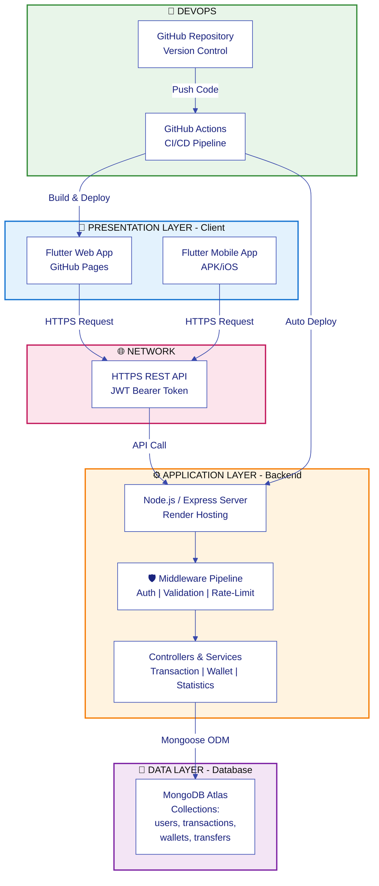

# Biểu đồ Kiến trúc hệ thống 3 lớp (3-Tier)

> **📌 Chọn phiên bản phù hợp với nhu cầu của bạn:**
>
> | Phiên bản                | Mục đích                 | Kích thước  | Link                                                                   |
> | ------------------------ | ------------------------ | ----------- | ---------------------------------------------------------------------- |
> | 📊 **SLIDE**             | Trình bày slide, báo cáo | Vừa 1 trang | [ARCHITECTURE_SLIDE.md](./ARCHITECTURE_SLIDE.md) ⭐                    |
> | 📌 **3-TIER** (File này) | Tổng quan cơ bản         | 1 trang     | Xem bên dưới                                                           |
> | 📚 **CHI TIẾT**          | Tài liệu báo cáo đầy đủ  | 5+ trang    | [COMPREHENSIVE_ARCHITECTURE_VI.md](./COMPREHENSIVE_ARCHITECTURE_VI.md) |
>
> **💡 Khuyến nghị:** Dùng **ARCHITECTURE_SLIDE.md** cho slide vì vừa vặn & rõ ràng nhất!

## Tổng quan nhanh (Quick Overview)



---

## Các thành phần chính

### 1️⃣ **Presentation Layer (Client)**

- **Flutter Web:** Deployed trên GitHub Pages
- **Flutter Mobile:** APK (Android) + IPA (iOS)
- **State Management:** Provider (ChangeNotifier)
- **HTTP Client:** Dio library

### 2️⃣ **Application Layer (Backend)**

- **Framework:** Node.js + Express.js
- **Middleware:** JWT Auth, Input Validation, Rate Limiting, Error Handling
- **Controllers:** AuthController, TransactionController, WalletController, StatisticController
- **Services:** Business logic layer
- **Validators:** Joi schema + express-validator

### 3️⃣ **Data Layer (Database)**

- **MongoDB Atlas** (Cloud database)
- **Collections:** users, transactions, wallets, wallet_transfers
- **ORM:** Mongoose
- **Backup:** Atlas automatic backup

### 4️⃣ **DevOps & Infrastructure**

- **VCS:** GitHub repository
- **CI/CD:** GitHub Actions workflows
- **Backend Hosting:** Render
- **Database Hosting:** MongoDB Atlas
- **Web Hosting:** GitHub Pages + Cloudflare Pages

---

## 📊 Data Flow Example - CREATE TRANSACTION

```
Mobile App (UI)
    ↓ [User tạo giao dịch]
TransactionForm (Validation)
    ↓ [Form valid]
TransactionProvider
    ↓ [submitTransaction()]
ApiService (Dio HTTP Client)
    ↓ [POST /api/transactions]
HTTPS Network
    ↓ [Bearer JWT Header]
Express Router
    ↓ [Route matching]
Middleware Pipeline
    ├─ JWT Verification ✓
    ├─ Schema Validation ✓
    └─ Rate Limit Check ✓
    ↓
TransactionController
    ↓ [createTransaction()]
TransactionService
    ↓ [Business logic]
Mongoose Model
    ↓ [MongoDB Insert]
Database (Stored)
    ↓
Response { success: true, data: {...} }
    ↓ [HTTPS Response 201]
ApiService (Parse JSON)
    ↓
Provider State Update
    ↓ [notifyListeners()]
UI Rebuild
    ↓
New transaction appears ✓
```

---

## 🔐 Security Features

- ✅ **JWT Authentication** - Stateless, secure token
- ✅ **Password Hashing** - bcrypt with salt rounds
- ✅ **HTTPS/TLS** - All communications encrypted
- ✅ **CORS** - Origin whitelist
- ✅ **Rate Limiting** - 100 requests per 15 minutes
- ✅ **Input Validation** - Joi schema + express-validator
- ✅ **Error Handling** - No sensitive data exposure
- ✅ **Helmet.js** - Security headers

---

**Để chi tiết hơn → Xem: [COMPREHENSIVE_ARCHITECTURE.md](./COMPREHENSIVE_ARCHITECTURE.md)** 🔍
