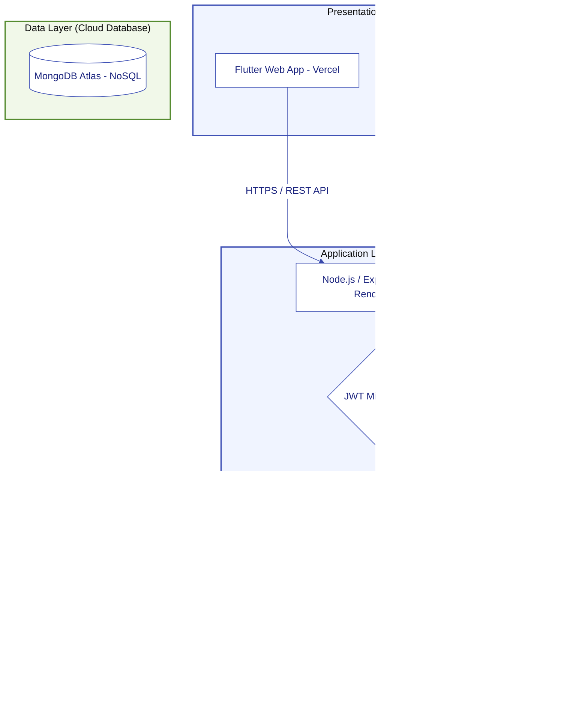

# Biểu đồ Kiến trúc hệ thống 3 lớp (3-Tier)

```mermaid
%%{init: {
    'theme': 'base',
    'themeVariables': {
        'primaryColor': '#e8eaf6',
        'primaryTextColor': '#1a237e',
        'primaryBorderColor': '#3f51b5',
        'lineColor': '#3949ab',
        'secondaryColor': '#ffffff',
        'tertiaryColor': '#f5f5f5',
        'mainBkg': '#ffffff',
        'nodeBorder': '#3f51b5',
        'clusterBkg': '#fafafa',
        'clusterBorder': '#7986cb',
        'fontSize': '15px'
    }
}}%%

graph TD
    subgraph Presentation_Layer ["Presentation Layer (Client)"]
        A[Flutter Web App - Vercel]
        B[Flutter Mobile App - APK/iOS]
    end

    subgraph Application_Layer ["Application Layer (Server)"]
        C[Node.js / Express Server - Render.com]
        D{JWT Middleware}
        E[Services: Transaction, Wallet, Auth]
    end

    subgraph Data_Layer ["Data Layer (Cloud Database)"]
        F[(MongoDB Atlas - NoSQL)]
    end

    %% Kết nối luồng
    A & B ---->|HTTPS / REST API| C
    C --> D
    D --> E
    E ---->|Mongoose ODM| F.

    %% Định dạng màu sắc bổ sung cho trực quan
    style Presentation_Layer fill:#f0f4ff,stroke:#3f51b5,stroke-width:2px
    style Application_Layer fill:#f0f4ff,stroke:#3f51b5,stroke-width:2px
    style Data_Layer fill:#f1f8e9,stroke:#558b2f,stroke-width:2px
    style F fill:#ffffff,stroke:#
```
