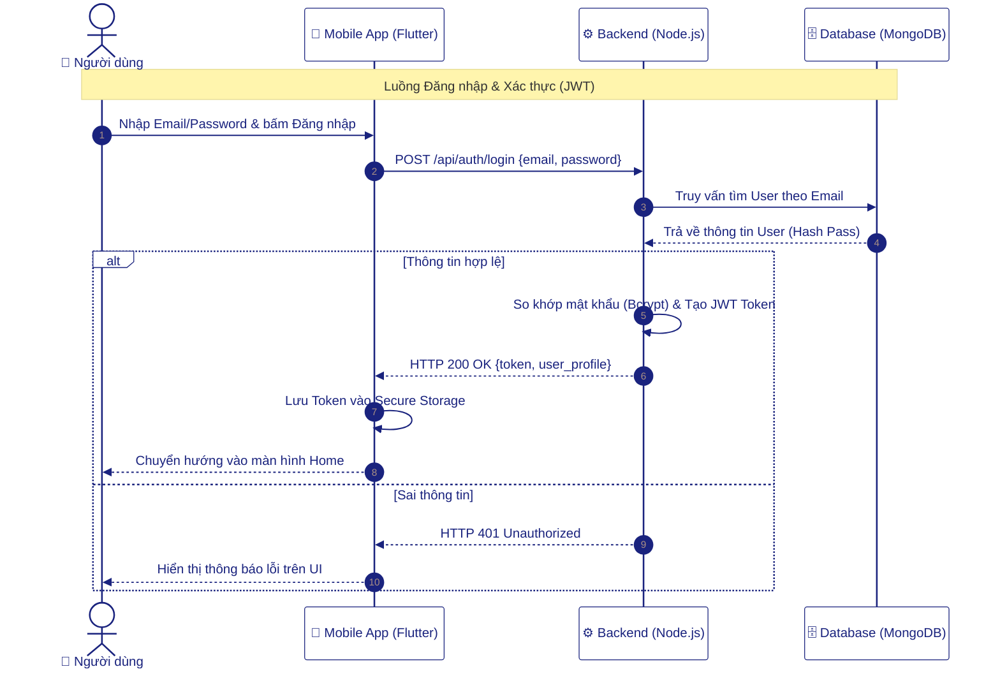

# Biểu đồ Luồng Đăng nhập - Modern Light

```mermaid
%%{init: {
    'theme': 'base',
    'themeVariables': {
        'primaryColor': '#ffffff',
        'primaryTextColor': '#1a237e',
        'primaryBorderColor': '#1a237e',
        'lineColor': '#546e7a',
        'secondaryColor': '#f5f5f5',
        'tertiaryColor': '#e3f2fd',
        'fontSize': '14px',
        'fontFamily': 'Arial'
    }
}}%%

sequenceDiagram
    autonumber
    actor User as 👤 Người dùng
    participant App as 📱 Mobile App (Flutter)
    participant API as ⚙️ Backend (Node.js)
    participant DB as 🗄️ Database (MongoDB)

    Note over User, DB: Luồng Đăng nhập & Xác thực (JWT)

    User->>App: Nhập Email/Password & bấm Đăng nhập
    App->>API: POST /api/auth/login {email, password}

    API->>DB: Truy vấn tìm User theo Email
    DB-->>API: Trả về thông tin User (Hash Pass)

    alt Thông tin hợp lệ
        API->>API: So khớp mật khẩu (Bcrypt) & Tạo JWT Token
        API-->>App: HTTP 200 OK {token, user_profile}
        App->>App: Lưu Token vào Secure Storage
        App-->>User: Chuyển hướng vào màn hình Home
    else Sai thông tin
        API-->>App: HTTP 401 Unauthorized
        App-->>User: Hiển thị thông báo lỗi trên UI
    end
```
