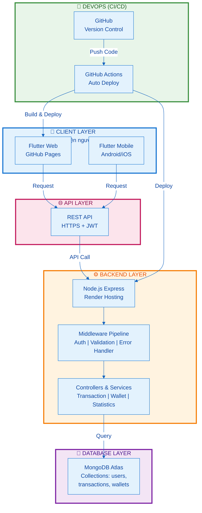

# Biểu đồ Kiến trúc SmartSpender - Phiên bản Slide (Tối ưu)

> **Phiên bản này được tối ưu hóa cho slide trình bày**
>
> - Chỉ 3 layers chính
> - Mỗi layer 2-3 thành phần
> - Rõ ràng, dễ hiểu, vừa 1 trang slide
> - Có thể in/chiếu mà không bị vỡ

---

## 📊 Biểu đồ Kiến trúc Tổng thể (Slide-Friendly)



---

## 📐 Mô tả từng Layer

### 1️⃣ CLIENT LAYER (Tầng Khách hàng)

- **Flutter Web:** Chạy trên trình duyệt
- **Flutter Mobile:** Chạy trên điện thoại Android/iOS

### 2️⃣ API LAYER (Tầng Giao tiếp)

- **REST API:** Chuẩn HTTP/HTTPS
- **JWT Authentication:** Token xác thực an toàn

### 3️⃣ BACKEND LAYER (Tầng Xử lý)

- **Express Server:** Nhận request từ client
- **Middleware:** Xác thực, kiểm tra, xử lý lỗi
- **Controllers & Services:** Logic xử lý nghiệp vụ

### 4️⃣ DATABASE LAYER (Tầng Lưu trữ)

- **MongoDB Atlas:** Cơ sở dữ liệu cloud
- **Collections:** Bảng dữ liệu chính

### 5️⃣ DEVOPS (Tự động hóa triển khai)

- **GitHub:** Quản lý mã nguồn
- **GitHub Actions:** Tự động build & deploy

---

## 🔄 Luồng Dữ liệu Ví dụ: Tạo Giao dịch

```
1. User mở app & nhập dữ liệu
   ↓
2. Client gửi POST request qua HTTPS
   (kèm JWT token trong header)
   ↓
3. Backend nhận request
   - Xác thực JWT ✓
   - Kiểm tra dữ liệu ✓
   - Xử lý logic ✓
   ↓
4. Lưu vào MongoDB
   ↓
5. Trả response 201 Created
   ↓
6. Client update UI
   ✓ Xong!
```

---

## 💡 Điểm nổi bật

✅ **3 Layers rõ ràng** - Dễ giải thích trên slide  
✅ **Rất ít chi tiết** - Không bị rối mắt  
✅ **Đủ thông tin** - Vẫn hiểu được kiến trúc  
✅ **Dễ nhớ** - Phù hợp cho trình bày miệng  
✅ **Vừa slide** - Không bị vỡ khi chiếu

---

**Để xem chi tiết hơn → Xem tài liệu báo cáo: `CHAPTER_7_8_REPORT.md`** 📄

---

_Phiên bản này được tối ưu hóa cho người trình bày slides._  
_Ngày cập nhật: 01/04/2026_
