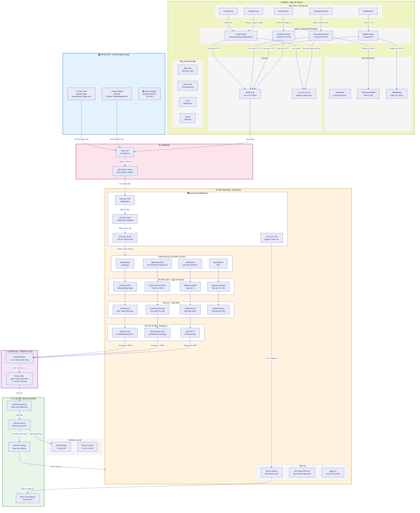

# SmartSpender - Biểu đồ Kiến trúc Tổng thể

## Kiến trúc 3 Lớp Chi tiết (3-Tier Architecture)



---

## Luồng Dữ liệu Chi tiết

### 1️⃣ **Tạo Giao dịch - CREATE TRANSACTION**

```
Giao diện Mobile (TransactionForm)
  ↓ [Xác thực phía khách hàng]
Provider.submitTransaction()
  ↓ [Gọi API]
API Service (POST /api/transactions)
  ↓ [HTTPS + JWT]
Express Server
  ↓ [JWT Middleware]
Xác thực ✓
  ↓ [Validation Middleware]
Schema được xác thực ✓
  ↓ [Giới hạn Tốc độ]
Trong giới hạn ✓
  ↓ [Khớp Tuyến đường]
TransactionController.createTransaction()
  ↓ [Logic Kinh doanh]
TransactionService.create()
  ↓ [Hoạt động Cơ sở dữ liệu]
Mongoose → MongoDB.insert()
  ↓ [Cập nhật Ví]
WalletService.updateBalance()
  ↓ [Trả lời Phản hồi]
{ success: true, data: transaction }
  ↓ [Phản hồi HTTP]
API Service
  ↓ [Phân tích JSON]
TransactionModel.fromJson()
  ↓ [Cập nhật Trạng thái]
Provider.notifyListeners()
  ↓ [Xây dựng Tiện ích]
TransactionList cập nhật ✓
```

### 2️⃣ **Lấy Giao dịch - READ TRANSACTIONS (với Bộ lọc)**

```
Giao diện Mobile (Năm Biểu mẫu)
  ↓ [Người dùng thay đổi bộ lọc]
Provider.fetchTransactions(tháng, năm, loại, danh mục)
  ↓ [Xây dựng Chuỗi Truy vấn]
API Service (GET /api/transactions?month=3&year=2026&type=expense)
  ↓ [HTTPS + JWT]
Express Server
  ↓ [JWT Middleware]
Xác thực ✓
  ↓ [Validation Middleware]
Các tham số Truy vấn được xác thực ✓
  ↓ [Khớp Tuyến đường]
TransactionController.getTransactions()
  ↓ [Xây dựng Truy vấn MongoDB]
TransactionService.findByFilters()
  ↓ [Mongoose Truy vấn]
MongoDB.find({ userId, date: {...}, type: ... })
  ↓ [Tổng hợp/Sắp xếp/Phân trang]
[Mảng Giao dịch]
  ↓ [Định dạng Phản hồi]
{ success: true, data: [...], total: 50, page: 1 }
  ↓ [Phản hồi HTTP]
API Service
  ↓ [Phân tích Mảng JSON]
for each → TransactionModel.fromJson()
  ↓ [Cập nhật Trạng thái]
Provider.transactions = [...]
Provider.notifyListeners()
  ↓ [Xây dựng lại Giao diện]
ListView với Giao dịch mới ✓
```

### 3️⃣ **Xác thực - AUTHENTICATION**

```
Giao diện Mobile (LoginScreen)
  ↓ [Email + Mật khẩu]
Provider.login(email, mật khẩu)
  ↓ [Xác thực phía khách hàng]
Email & Định dạng Mật khẩu hợp lệ ✓
  ↓ [Gọi API]
API Service (POST /api/auth/login)
  ↓ [Request Body: { email, mật khẩu }]
Express Server
  ↓ [Body Parser Middleware]
  ↓ [Validation Middleware]
Schema được xác thực ✓
  ↓ [Khớp Tuyến đường]
AuthController.login()
  ↓ [Tìm Người dùng theo Email]
AuthService.findUserByEmail()
  ↓ [Truy vấn MongoDB]
Tài liệu Người dùng được Lấy
  ↓ [So sánh Hash Mật khẩu]
bcrypt.compare(mật khẩu, hash)
  ↓ [Phù hợp ✓]
Tạo Token JWT
  ↓ [jose.sign({ userId, email }, secret)]
Trả lại { token, user }
  ↓ [Phản hồi HTTP 200]
API Service
  ↓ [Trích xuất Token]
Provider.setToken()
  ↓ [Lưu vào shared_preferences]
  ↓ [Cập nhật isAuthenticated = true]
Provider.notifyListeners()
  ↓ [Xây dựng lại Navigation]
Chuyển hướng sang HomeScreen ✓
```

### 4️⃣ **Cập nhật Giao dịch - UPDATE TRANSACTION**

```
Giao diện Mobile (Chi tiết Giao dịch)
  ↓ [Nhấn Chỉnh sửa]
Form mở với Dữ liệu Cũ
  ↓ [Người dùng thay đổi Số tiền]
Provider.updateTransaction(id, updatedData)
  ↓ [Xác thực Phía khách hàng]
Dữ liệu hợp lệ ✓
  ↓ [Gọi API]
API Service (PUT /api/transactions/:id)
  ↓ [HTTPS + JWT]
Express Server
  ↓ [Middleware Pipeline]
Xác thực Thành công ✓
  ↓ [TransactionController.updateTransaction()]
  ↓ [TransactionService.update()]
Mongoose → MongoDB.updateOne()
  ↓ [Tính toán lại Số dư Ví]
WalletService.recalculateBalance()
  ↓ [{ success: true, data: updatedTransaction }]
  ↓ [Phản hồi HTTP]
API Service
  ↓ [Phân tích JSON]
Provider.updateLocalTransaction()
  ↓ [notifyListeners()]
Danh sách cập nhật ✓
```

### 5️⃣ **Xóa Giao dịch - DELETE TRANSACTION**

```
Giao diện Mobile (Danh sách Giao dịch)
  ↓ [Long-press / Swipe để xóa]
Hộp thoại Xác nhận
  ↓ [Người dùng xác nhận]
Provider.deleteTransaction(id)
  ↓ [Gọi API]
API Service (DELETE /api/transactions/:id)
  ↓ [HTTPS + JWT]
Express Server
  ↓ [Middleware & Controller]
  ↓ [TransactionService.delete()]
MongoDB.deleteOne({ _id: id })
  ↓ [Lấy Giao dịch Cũ để tính toán Số dư]
WalletService.restoreBalance()
  ↓ [{ success: true }]
  ↓ [Phản hồi HTTP]
API Service
  ↓ [Provider.removeTransaction(id)]
  ↓ [notifyListeners()]
Giao dịch biến mất ✓
Toast "Xóa thành công" ✓
```

---

## Thành phần Chính

### 📱 **Lớp Sơ kết (Presentation Layer)**

| Thành phần             | Mô tả                                 |
| ---------------------- | ------------------------------------- |
| **Flutter Web**        | Ứng dụng web trên GitHub Pages        |
| **Flutter Mobile**     | APK (Android) + IPA (iOS)             |
| **Provider**           | Quản lý Trạng thái với ChangeNotifier |
| **Dio**                | HTTP Client cho API Call              |
| **shared_preferences** | Lưu trữ Token & Dữ liệu Cục bộ        |

### ⚙️ **Lớp Ứng dụng (Application Layer)**

| Thành phần        | Mô tả                          |
| ----------------- | ------------------------------ |
| **Express.js**    | Framework Web chính            |
| **JWT Auth**      | Xác thực Stateless             |
| **Joi Validator** | Xác thực Schema Input          |
| **Middleware**    | Xử lý yêu cầu trước Controller |
| **Controllers**   | Xử lý Business Logic           |
| **Services**      | Lớp Logic Miền                 |
| **Mongoose**      | ODM cho MongoDB                |

### 💾 **Lớp Dữ liệu (Data Layer)**

| Thành phần        | Mô tả                                   |
| ----------------- | --------------------------------------- |
| **MongoDB Atlas** | Cơ sở dữ liệu Đám mây                   |
| **Collections**   | users, transactions, wallets, transfers |
| **Indexes**       | Tối ưu hóa Truy vấn                     |
| **Validation**    | Schema Validation                       |

### 🚀 **Cơ sở Hạ tầng (Infrastructure)**

| Thành phần         | Mô tả                   |
| ------------------ | ----------------------- |
| **GitHub**         | Kiểm soát Phiên bản     |
| **GitHub Actions** | CI/CD tự động           |
| **Render**         | Hosting Backend Node.js |
| **GitHub Pages**   | Hosting Web tĩnh        |
| **MongoDB Atlas**  | Hosting Cơ sở dữ liệu   |

---

## Tính năng Bảo mật

✅ **JWT Authentication** - Token không có Trạng thái (Stateless)  
✅ **Password Hashing** - bcrypt với Salt Rounds  
✅ **HTTPS/TLS** - Mã hóa tất cả Giao tiếp  
✅ **CORS** - Danh sách Trắng Origin  
✅ **Rate Limiting** - 100 yêu cầu mỗi 15 phút  
✅ **Input Validation** - Joi Schema + express-validator  
✅ **Error Handling** - Không tiếp lộ Dữ liệu Nhạy cảm  
✅ **Helmet.js** - Security Headers

---

**Cập nhật lần cuối:** 01/04/2026  
**Trạng thái:** ✅ Hoàn chỉnh & Sẵn sàng
