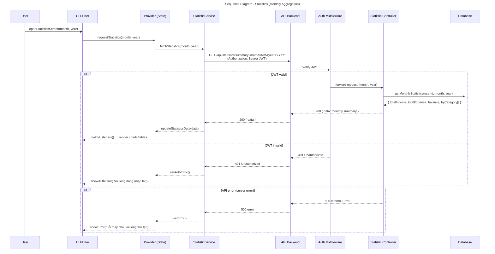

# Sequence Diagram - Statistics (Monthly Aggregation)

Biểu đồ luồng tính năng Thống kê: lấy tổng hợp hàng tháng (thu, chi, số dư theo danh mục).

## Technical Details

| Attribute             | Value                                                                                       |
| --------------------- | ------------------------------------------------------------------------------------------- |
| **Endpoint**          | `GET /api/statistics/summary?month=<MM>&year=<YYYY>`                                        |
| **Authorization**     | JWT Bearer token in Authorization header                                                    |
| **Query Params**      | `month` (1-12), `year` (YYYY)                                                               |
| **Response Format**   | `{ success: true, data: { totalIncome, totalExpense, balanceByCategory }, message: "..." }` |
| **Controller Method** | `getSummary()` calls `StatisticService.getMonthlyStatistics()`                              |
| **Aggregation**       | Runs on `transactions` collection, grouped by `category`                                    |
| **Error Codes**       | 401 (unauthorized), 500 (server error)                                                      |

## Key Points

- Thống kê được tính toán **theo ví** (walletType) hoặc **theo danh mục** (category)
- Dữ liệu được **lấy từ transaction history** trong tháng/năm chỉ định
- Cơ chế **reconcile số dư** từ toàn bộ lịch sử giao dịch (không chỉ tháng hiện tại)
- Xử lý **JWT validation** tại middleware trước khi vào controller
