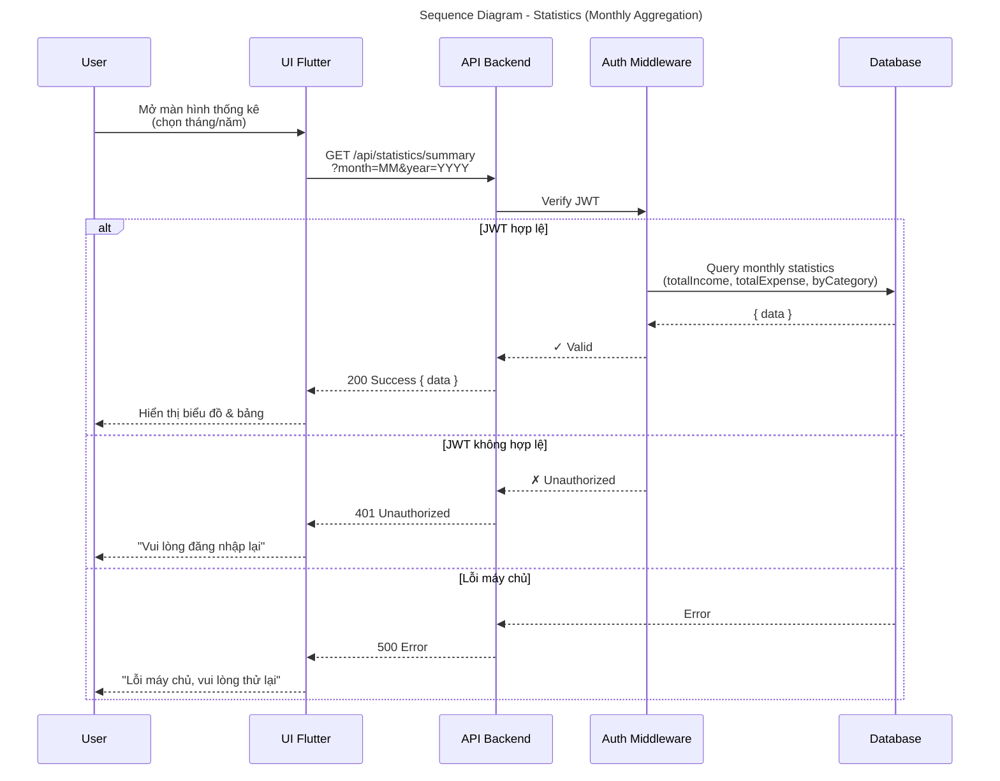

# Sequence Diagram - Statistics (Simplified for Slide)

Biểu đồ luồng tính năng Thống kê (bản rút gọn): lấy tổng hợp hàng tháng (thu, chi, số dư theo danh mục).

## Technical Details

| Attribute           | Value                                                                                       |
| ------------------- | ------------------------------------------------------------------------------------------- |
| **Endpoint**        | `GET /api/statistics/summary?month=<MM>&year=<YYYY>`                                        |
| **Authorization**   | JWT Bearer token in Authorization header                                                    |
| **Query Params**    | `month` (1-12), `year` (YYYY)                                                               |
| **Response Format** | `{ success: true, data: { totalIncome, totalExpense, balanceByCategory }, message: "..." }` |
| **Success Code**    | 200 Ok                                                                                      |
| **Error Codes**     | 401 (unauthorized), 500 (server error)                                                      |

## Key Points

- Lấy dữ liệu từ **transaction history** trong tháng/năm chỉ định
- Tính tổng **Thu**, **Chi**, **Số dư** theo **Danh mục**
- Xử lý JWT validation tại Auth Middleware
- Hiển thị error messages tiếng Việt cho người dùng
