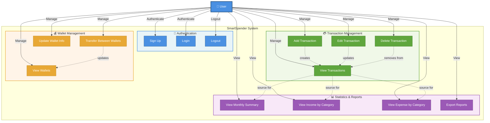

# Use Case Diagram - SmartSpender Application

Biểu đồ use case tổng quát các chức năng chính của ứng dụng SmartSpender.

## Mô tả Use Cases

### 🔐 Authentication (Xác thực)

| Use Case    | Mô tả                              | Actor |
| ----------- | ---------------------------------- | ----- |
| **Sign Up** | Người dùng tạo tài khoản mới       | User  |
| **Login**   | Người dùng đăng nhập vào hệ thống  | User  |
| **Logout**  | Người dùng đăng xuất khỏi hệ thống | User  |

### 💳 Transaction Management (Quản lý giao dịch)

| Use Case               | Mô tả                                    | Actor |
| ---------------------- | ---------------------------------------- | ----- |
| **Add Transaction**    | Người dùng tạo giao dịch mới (thu/chi)   | User  |
| **View Transactions**  | Người dùng xem danh sách giao dịch       | User  |
| **Edit Transaction**   | Người dùng chỉnh sửa thông tin giao dịch | User  |
| **Delete Transaction** | Người dùng xóa giao dịch                 | User  |

### 💰 Wallet Management (Quản lý ví)

| Use Case                     | Mô tả                                | Actor |
| ---------------------------- | ------------------------------------ | ----- |
| **View Wallets**             | Người dùng xem danh sách ví và số dư | User  |
| **Transfer Between Wallets** | Người dùng chuyển tiền giữa các ví   | User  |
| **Update Wallet Info**       | Người dùng cập nhật tên/mô tả ví     | User  |

### 📊 Statistics & Reports (Thống kê & Báo cáo)

| Use Case                     | Mô tả                               | Actor |
| ---------------------------- | ----------------------------------- | ----- |
| **View Monthly Summary**     | Xem tổng hợp thu/chi theo tháng     | User  |
| **View Income by Category**  | Xem chi tiết thu nhập theo danh mục | User  |
| **View Expense by Category** | Xem chi tiết chi phí theo danh mục  | User  |
| **Export Reports**           | Xuất báo cáo ra file (PDF/Excel)    | User  |

## Mối quan hệ giữa các Use Cases

- **Create → Read**: Tạo giao dịch mới sẽ xuất hiện trong danh sách giao dịch
- **Edit/Delete → Update View**: Chỉnh sửa/xóa giao dịch cập nhật danh sách
- **Transfer → Wallet Balance**: Chuyển tiền giữa ví sẽ cập nhật số dư
- **Transactions → Statistics**: Dữ liệu giao dịch là nguồn tính toán thống kê

## Màu sắc theo chức năng

- 🔵 **Xanh dương** (Authentication): Bảo mật & xác thực
- 🟢 **Xanh lá** (Transactions): Quản lý dữ liệu giao dịch
- 🟠 **Cam** (Wallets): Quản lý tài sản
- 🟣 **Tím** (Statistics): Phân tích & báo cáo
