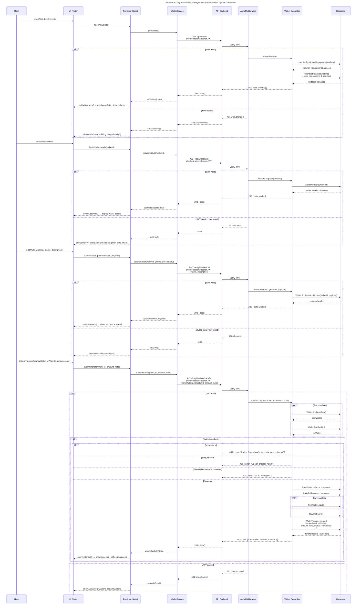

# Sequence Diagram - Wallet Management

Biểu đồ luồng quản lý ví: lấy danh sách ví, xem chi tiết, cập nhật thông tin, và chuyển tiền giữa các ví.

## Technical Details

### Endpoints

| Method | Endpoint                | Purpose                               | Auth  |
| ------ | ----------------------- | ------------------------------------- | ----- |
| GET    | `/api/wallets`          | Lấy danh sách ví + reconcile balances | JWT ✓ |
| GET    | `/api/wallets/:id`      | Lấy chi tiết 1 ví                     | JWT ✓ |
| PATCH  | `/api/wallets/:id`      | Cập nhật tên/mô tả ví                 | JWT ✓ |
| POST   | `/api/wallets/transfer` | Chuyển tiền giữa ví                   | JWT ✓ |

### Wallet Lifecycle

- **Auto-create**: Ví được tạo tự động lần đầu khi user gọi `GET /api/wallets` (nếu chưa tồn tại):
  - Cash (Tiền mặt)
  - Bank (Ngân hàng)
  - E-wallet (Ví điện tử)
- **No delete**: Hệ thống không cho phép xóa ví

### Transfer Logic

| Check              | Validation                     | Error Message                               |
| ------------------ | ------------------------------ | ------------------------------------------- |
| Same wallet        | `from !== to`                  | "Không được chuyển từ ví này sang chính nó" |
| Amount > 0         | `amount > 0`                   | "Số tiền phải lớn hơn 0"                    |
| Sufficient balance | `fromWallet.balance >= amount` | "Số dư không đủ"                            |
| Balance update     | Promise.all (atomic save)      | Không lock (race condition risk)            |
| Audit trail        | `WalletTransfer.create()`      | Lưu lịch sử chuyển tiền                     |

### Reconciliation

- Mỗi lần gọi `GET /api/wallets`, hệ thống **tính toán lại số dư** từ:
  - Tất cả `Transaction` liên quan (income/expense)
  - Tất cả `WalletTransfer` (transfer in/out)
- **Công thức**: `balance = sum(transactions) + sum(transfersIn) - sum(transfersOut)`

### Error Codes

| Code | Scenario                                                         |
| ---- | ---------------------------------------------------------------- |
| 200  | Success                                                          |
| 400  | Validation error (same wallet, amount ≤ 0, insufficient balance) |
| 401  | JWT invalid or expired                                           |
| 404  | Wallet not found                                                 |
| 500  | Server error                                                     |
