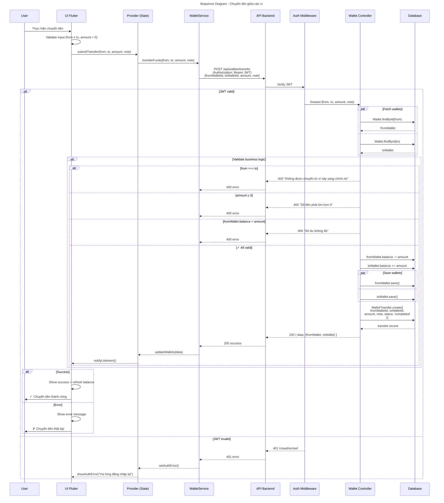

# Sequence Diagram - Wallet Transfer (Slide Version)

Biểu đồ luồng chuyển tiền giữa ví - phiên bản tối ưu cho slide trình bày.



## 📋 Chi tiết kỹ thuật

### Endpoint

```
POST /api/wallets/transfer
Authorization: Bearer JWT
Content-Type: application/json

{
  "fromWalletId": "wallet_id_1",
  "toWalletId": "wallet_id_2",
  "amount": 100000,
  "note": "Chuyển từ tiền mặt sang ngân hàng"
}
```

### Response (200 Success)

```json
{
  "success": true,
  "data": {
    "fromWallet": {
      "id": "wallet_id_1",
      "walletType": "Cash",
      "balance": 400000
    },
    "toWallet": {
      "id": "wallet_id_2",
      "walletType": "Bank",
      "balance": 600000
    },
    "transfer": {
      "id": "transfer_id",
      "fromWalletId": "wallet_id_1",
      "toWalletId": "wallet_id_2",
      "amount": 100000,
      "note": "Chuyển từ tiền mặt sang ngân hàng",
      "status": "completed",
      "createdAt": "2024-04-01T10:30:00Z"
    }
  }
}
```

### Validation Rules

| Rule                | Condition                      | Error Message                             |
| ------------------- | ------------------------------ | ----------------------------------------- |
| **Same Wallet**     | `from !== to`                  | Không được chuyển từ ví này sang chính nó |
| **Amount > 0**      | `amount > 0`                   | Số tiền phải lớn hơn 0                    |
| **Sufficient Fund** | `fromWallet.balance >= amount` | Số dư không đủ                            |

### Key Features

✅ **Atomic Save**: `Promise.all()` đảm bảo cả 2 ví được cập nhật cùng lúc  
✅ **Audit Trail**: Tạo `WalletTransfer` record lưu lịch sử chuyển tiền  
✅ **JWT Auth**: Xác minh người dùng trước khi xử lý  
✅ **Error Handling**: Kiểm tra tất cả điều kiện validation trước

### Flow Diagram Summary

```
1️⃣ User nhập thông tin chuyển tiền (from, to, amount)
   ↓
2️⃣ Validate client-side: from ≠ to, amount > 0
   ↓
3️⃣ Submit API request + JWT token
   ↓
4️⃣ Server verify JWT + fetch cả 2 ví
   ↓
5️⃣ Server validate business logic (đủ tiền, ...)
   ↓
6️⃣ Update balances + save wallets
   ↓
7️⃣ Create WalletTransfer record (audit trail)
   ↓
8️⃣ Return success + updated balances
   ↓
9️⃣ UI refresh + show success message
```
