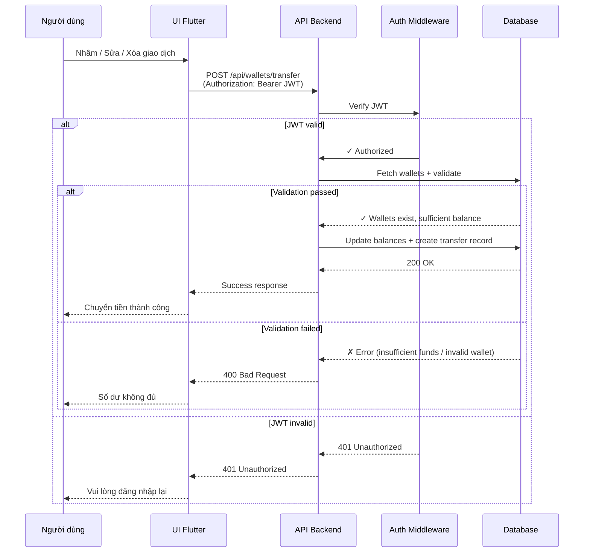

# Sequence Diagram - Wallet Transfer (Simplified for Slide)

Biểu đồ luồng chuyển tiền giữa các ví - phiên bản rút gọn dành cho slide thuyết trình.

## Flow Overview

| Step | Action | Status |
|------|--------|--------|
| 1 | User submits transfer request | UI ← User |
| 2 | Send HTTP request with JWT | API ← UI |
| 3 | Verify authentication token | Auth Middleware |
| 4 | Validate inputs + check balance | Database Query |
| 5 | Update wallets + create transfer record | Database Update |
| 6 | Return success/error response | UI ← API |

## Key Points

- **Main Feature**: Chuyển tiền giữa 2 ví của cùng một người dùng
- **Validation**: Kiểm tra JWT, kiểm tra số dư đủ, kiểm tra ví hợp lệ
- **Atomic Operation**: Promise.all() để update 2 ví cùng lúc
- **Audit Trail**: Tạo `WalletTransfer` record để tracking
- **Error Handling**: 401 (unauthorized), 400 (bad request)
